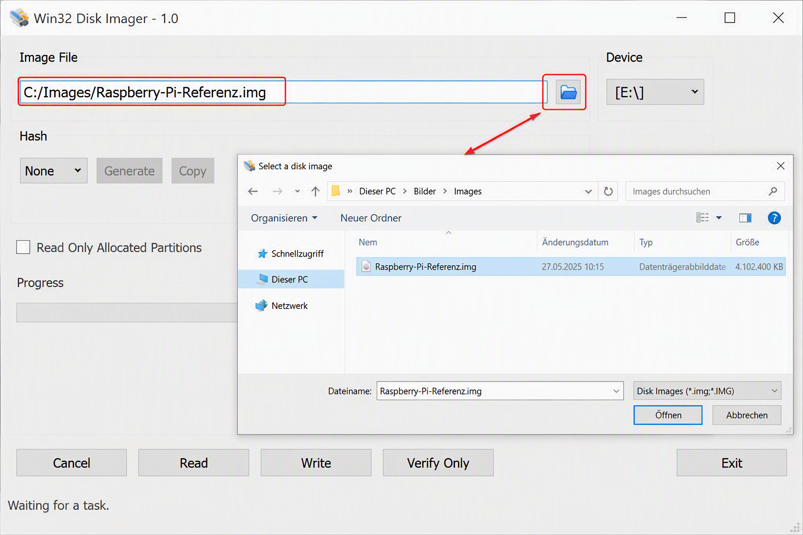

# KB00006 – Raspberry Pi Referenz-Image erstellen und auf weitere Geräte übertragen

## Betroffene Systeme

- Raspberry Pi
- Raspberry Pi OS
- microSD-Karten
- Windows 10/11
- Win32 Disk Imager

## Kategorie

Linux / Raspberry Pi / Imaging / Deployment

## Zielgruppe

- IT Support
- Systemadministratoren
- Fachinformatiker für Systemintegration

---

# 1. Problembeschreibung

Mehrere Raspberry-Pi-Geräte sollten mit einer identischen Grundkonfiguration bereitgestellt werden.

Die manuelle Installation und Konfiguration jedes einzelnen Geräts hätte einen hohen Zeitaufwand verursacht.

Aus diesem Grund wurde ein Referenzsystem erstellt und anschließend auf weitere Raspberry-Pi-Geräte übertragen.

---

# 2. Ursache des Problems

Ohne ein Referenz-Image müssten alle Geräte einzeln installiert und konfiguriert werden.

Dadurch steigt der Zeitaufwand und die Gefahr unterschiedlicher Konfigurationen.

---

# 3. Voraussetzungen für die Lösung

Benötigt werden:

- Raspberry Pi mit vollständig eingerichteter Referenzinstallation
- microSD-Karte des Referenzsystems
- Weitere microSD-Karten
- Windows-PC
- Kartenleser
- Win32 Disk Imager

---

# 4. Lösung

## Schritt 1: Referenzsystem vorbereiten

Vor der Erstellung des Images sicherstellen:

- Raspberry Pi OS installiert
- System erfolgreich gestartet
- Updates durchgeführt
- Benutzer eingerichtet
- XRDP getestet
- Funktionstest erfolgreich abgeschlossen

---

## Schritt 2: Raspberry Pi herunterfahren

```bash
sudo shutdown -h now
```

Nach dem Herunterfahren:

- Netzteil entfernen
- microSD-Karte entnehmen

---

## Schritt 3: microSD-Karte an den Windows-PC anschließen

microSD-Karte in den Kartenleser einsetzen.

---

## Schritt 4: Win32 Disk Imager starten

Win32 Disk Imager öffnen.

Falls erforderlich:

```text
Als Administrator ausführen
```

---

## Übersicht der Imaging-Konfiguration

> Hier den Screenshot einfügen.


---

## Schritt 5: Image-Datei auswählen

Unter:

```text
Image File
```

Der folgende Screenshot zeigt die Auswahl der Image-Datei in Win32 Disk Imager.



---

## Schritt 6: Referenzsystem auslesen

Unter:

```text
Device
```

die passende microSD-Karte auswählen.

Anschließend:

```text
Read
```

anklicken.

Win32 Disk Imager erstellt nun ein vollständiges Abbild der microSD-Karte.

---

## Schritt 7: Neue microSD-Karte anschließen

Die nächste microSD-Karte in den Kartenleser einsetzen.

---

## Schritt 8: Referenz-Image übertragen

Das zuvor erstellte Image auswählen.

Beispiel:

```text
Raspberry-Pi-Referenz.img
```

Anschließend:

```text
Write
```

anklicken.

Das Image wird auf die neue microSD-Karte übertragen.

---

## Schritt 9: Raspberry Pi starten

microSD-Karte einsetzen.

Raspberry Pi starten.

---

## Schritt 10: Gerät prüfen

Nach dem Start kontrollieren:

- Raspberry Pi OS startet
- Netzwerk funktioniert
- Benutzerkonto funktioniert
- XRDP funktioniert
- Remote Desktop Anmeldung funktioniert

---

## Schritt 11: Hostname prüfen

```bash
hostname
```

Falls erforderlich:

```bash
sudo raspi-config
```

Einen eindeutigen Hostnamen konfigurieren.

Beispiele:

```text
raspi-001
raspi-002
raspi-003
raspi-004
raspi-005
raspi-006
```

---

# 5. Kontrolle nach der Lösung

Prüfen:

- Referenz-Image erfolgreich erstellt
- Image erfolgreich geschrieben
- Raspberry Pi startet
- Netzwerk funktioniert
- Benutzerkonto vorhanden
- XRDP funktioniert
- Hostname eindeutig
- Gerät betriebsbereit

---

# 6. Ergebnis

Ein vollständig eingerichteter Raspberry Pi wurde als Referenzsystem verwendet.

Von der microSD-Karte wurde ein Referenz-Image erstellt.

Das Image wurde erfolgreich auf weitere Raspberry-Pi-Geräte übertragen.

Dadurch konnten mehrere Geräte mit identischer Grundkonfiguration schnell und standardisiert bereitgestellt werden.

---

# 7. Was habe ich gelernt?

- Referenzsysteme erstellen
- Win32 Disk Imager verwenden
- Images auslesen
- Images auf weitere Geräte übertragen
- Mehrere Raspberry-Pi-Geräte standardisiert bereitstellen
- Hostnamen nach dem Klonen prüfen
- Rollout-Prozesse dokumentieren

---

## Autor

Ahmad Javid Qarizadah

Bachelor of Computer Science

Auszubildender Fachinformatiker für Systemintegration

---

## Projekt

Persönliche IT Knowledge Base zur Dokumentation von Raspberry Pi, Imaging und Deployment während der Ausbildung.
